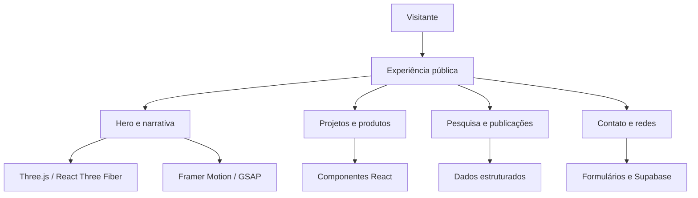

<div align="center">

# TROPA CIENTÍFICA

### Portfólio autoral de tecnologia, inteligência artificial e comunicação científica

[](https://www.tropacientifica.com)
[](https://react.dev/)
[](https://www.typescriptlang.org/)
[](https://threejs.org/)
[](https://supabase.com/)

</div>

---

## Visão geral

A **Tropa Científica** é uma experiência web autoral criada para apresentar projetos, pesquisa, tecnologia, inteligência artificial e produção científica em uma linguagem visual de alta autoridade.

O projeto foi desenvolvido de forma end-to-end por **Matheus Florindo de Deus**, incluindo:

- estratégia e planejamento do produto;
- naming, identidade visual e logomarca;
- arquitetura da informação e UX/UI;
- desenvolvimento front-end e integração com backend;
- narrativa, conteúdo e comunicação científica;
- domínio, publicação e evolução contínua.

**Demonstração pública:** [www.tropacientifica.com](https://www.tropacientifica.com)

---

## Diferenciais do projeto

### Experiência visual e 3D

- cenas e elementos tridimensionais com Three.js;
- composição com React Three Fiber e Drei;
- animações declarativas com Framer Motion;
- timelines e gatilhos de scroll com GSAP;
- narrativa visual orientada pela rolagem;
- SVGs animados, glassmorphism e microinterações.

### Produto e arquitetura

- aplicação React com TypeScript;
- design system baseado em Tailwind CSS e componentes reutilizáveis;
- formulários estruturados com validação;
- integração com Supabase para dados, autenticação e serviços;
- organização por páginas, componentes, hooks, dados e utilitários;
- experiência responsiva para desktop, tablet e dispositivos móveis.

### Ciência e conteúdo

- apresentação de trajetória acadêmica e profissional;
- integração com ORCID e Currículo Lattes;
- comunicação de publicações e projetos científicos;
- conexão entre tecnologia, segurança pública, educação e desempenho humano.

---

## Stack principal

| Camada | Tecnologias |
|:---|:---|
| **Frontend** | React, TypeScript, Vite, Tailwind CSS |
| **3D e WebGL** | Three.js, React Three Fiber, Drei |
| **Motion** | Framer Motion, GSAP |
| **Componentes** | Shadcn/UI, Radix UI |
| **Dados e formulários** | TanStack Query, React Hook Form, Zod |
| **Backend** | Supabase — PostgreSQL, autenticação, storage e serviços |
| **Visualização** | Recharts, Canvas e SVG |

---

## Arquitetura funcional



---

## Execução local

### Requisitos

- Node.js 18 ou superior;
- npm ou gerenciador compatível;
- variáveis de ambiente do Supabase para recursos conectados.

### Instalação

```bash
git clone https://github.com/matheusflorindo32/responsive-realm-app.git
cd responsive-realm-app
npm install
npm run dev
```

### Build de produção

```bash
npm run build
npm run preview
```

---

## Variáveis de ambiente

Crie um arquivo `.env` local com as chaves necessárias ao ambiente:

```env
VITE_SUPABASE_URL=
VITE_SUPABASE_ANON_KEY=
```

Nunca publique chaves privadas ou arquivos `.env` no repositório.

---

## Qualidade e evolução

Antes de anunciar números de performance, acessibilidade ou tamanho de bundle, eles devem ser acompanhados por relatório reproduzível. A evolução técnica recomendada inclui:

- testes unitários para regras e componentes críticos;
- testes E2E dos fluxos públicos;
- auditoria Lighthouse versionada;
- validação automatizada de links;
- análise de bundle no processo de build;
- monitoramento de acessibilidade com axe-core.

---

## Autoria

**Matheus Florindo de Deus**  
Product Architect • Desenvolvedor de Produtos Digitais • Pesquisador CEFD/UFES

[](https://github.com/matheusflorindo32)
[](https://www.tropacientifica.com)

---

## Licença

Consulte o arquivo [LICENSE](LICENSE) do repositório para os termos aplicáveis ao código e aos ativos do projeto.
