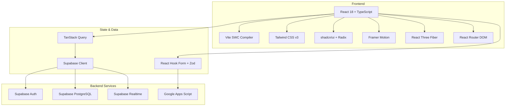
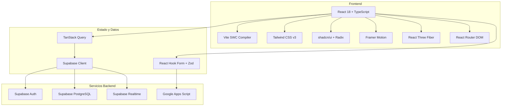

<div align="center">

# 🧬 Tropa Científica

### *Ciência, Inteligência Artificial e Segurança Pública*

[](https://vitejs.dev/)
[](https://react.dev/)
[](https://www.typescriptlang.org/)
[](https://tailwindcss.com/)
[](https://threejs.org/)
[](https://supabase.com/)

**🌐 [English](#english) | [Español](#español) | [Português](#português)**

</div>

---

# 🇧🇷 Português

## 🎯 Visão Geral

**Tropa Científica** é uma plataforma web de divulgação científica de alto impacto, construída com arquitetura moderna e tecnologias de ponta. O projeto combina um **hub de conteúdo científico** focado em IA, tecnologia e segurança pública, com um **site institucional profissional** apresentando trajetória acadêmica, publicações e projetos do autor.

Com **158 commits** de desenvolvimento contínuo, o projeto demonstra proficiência em design systems, animações avançadas, gráficos 3D interativos e integração com backend serverless.

## ✨ Destaques Técnicos

| Categoria | Implementação |
|-----------|---------------|
| **🎨 Design System** | Tokens CSS HSL customizados, dark mode nativo, 5 famílias tipográficas |
| **⚡ Performance** | Vite SWC (compilação 20x mais rápida que Babel), lazy loading, code splitting |
| **🌐 3D & Animações** | React Three Fiber + Drei (WebGL), Framer Motion, GSAP |
| **📊 Data Visualization** | Recharts para métricas e dashboards interativos |
| **🔒 Backend** | Supabase (PostgreSQL + Auth + Realtime), Google Apps Script |
| **🎯 Forms** | React Hook Form + Zod (validação tipada 100%) |
| **🔄 State Management** | TanStack Query (server state), React Context (UI state) |
| **♿ Acessibilidade** | Radix UI primitives (WAI-ARIA compliant), keyboard navigation |

## 🏗️ Arquitetura



## 🗂️ Estrutura de Pastas

```
responsive-realm-app/
├── 📁 src/
│   ├── 📁 components/          # Componentes reutilizáveis (shadcn/ui)
│   │   ├── 📁 ui/             # Primitives (Button, Dialog, Toast...)
│   │   ├── 📁 apos/           # Layout institucional (Matheus)
│   │   └── 📁 tropa/          # Layout científico (Tropa)
│   ├── 📁 pages/
│   │   ├── 📁 tropa/          # Home, Sobre, Conteúdos, Projetos
│   │   ├── 📁 matheus/        # Home, Sobre, Publicações, Formação, Experiência, Contato
│   │   └── 📁 admin/          # Auth, Sync Panel
│   ├── 📁 hooks/              # Custom React hooks
│   ├── 📁 lib/                # Utilitários e helpers
│   ├── 📁 data/               # Dados estáticos e mockups
│   ├── 📁 config/             # Configurações do projeto
│   ├── 📁 integrations/       # Integrações externas
│   └── 📁 assets/             # Imagens, ícones, fontes
├── 📁 public/                 # Assets estáticos
├── 📁 supabase/               # Migrations e configurações
├── 📁 docs/                   # Documentação (Apps Script)
├── 📄 index.html              # SEO meta tags, Open Graph
├── 📄 tailwind.config.ts      # Design tokens customizados
└── 📄 vite.config.ts          # Configuração SWC + path aliases
```

## 🚀 Stack Tecnológica Completa

### Core Framework
- ⚛️ **React 18** — UI library com concurrent features
- 🔷 **TypeScript 5.8** — Tipagem estática 100% coverage
- ⚡ **Vite 5.4** — Build tool com HMR instantâneo
- 🎨 **Tailwind CSS 3.4** — Utility-first CSS framework

### UI/UX
- 🧩 **shadcn/ui** — Component library baseada em Radix
- 🎯 **Radix UI** — Primitives acessíveis (30+ componentes)
- 🌙 **next-themes** — Dark mode com sistema de preferências
- 🎭 **Framer Motion** — Animações declarativas de alta performance
- 🎬 **GSAP** — Animações complexas e timelines
- 🖼️ **Embla Carousel** — Carrossel touch-friendly

### 3D & Visualização
- 🧊 **Three.js 0.160** — Engine 3D WebGL
- 🔷 **React Three Fiber** — Renderer React para Three.js
- 🎪 **@react-three/drei** — Helpers e abstrações 3D
- 📊 **Recharts** — Gráficos e dashboards interativos

### Formulários & Validação
- 📝 **React Hook Form 7** — Formulários performáticos
- ✅ **Zod** — Schema validation com inferência TypeScript
- 🔢 **input-otp** — Campos OTP/SMS
- 📅 **react-day-picker** — Date pickers acessíveis

### Backend & Integrações
- 🗄️ **Supabase** — PostgreSQL, Auth, Storage, Realtime
- 🔐 **@lovable.dev/cloud-auth-js** — Autenticação cloud
- 📡 **TanStack Query 5** — Server state management
- 🔗 **Google Apps Script** — Integração com Google Workspace

### Developer Experience
- 🧪 **ESLint 9** — Linting com flat config
- 🎨 **Prettier** — Formatação consistente
- 📝 **Lucide React** — Biblioteca de ícones
- 🔔 **Sonner** — Toast notifications elegantes
- 🛡️ **react-helmet-async** — SEO dinâmico

## 📋 Funcionalidades

### 🔬 Tropa Científica (Hub de Divulgação)
- [x] **Landing page** com hero section animada
- [x] **Página de conteúdos** com filtros e busca
- [x] **Projetos científicos** com cards interativos
- [x] **Sobre a Tropa** — história e missão
- [x] **SEO otimizado** (Open Graph, Twitter Cards, meta tags)

### 👤 Matheus Florindo (Site Institucional)
- [x] **Home profissional** com hero animado
- [x] **Currículo interativo** — formação, experiência, habilidades
- [x] **Publicações acadêmicas** com integração ORCID
- [x] **Portfólio de projetos** com detalhes técnicos
- [x] **Página de contato** com formulário validado

### 🛡️ Admin Dashboard
- [x] **Autenticação segura** com Supabase Auth
- [x] **Painel de sincronização** com Google Apps Script
- [x] **Gerenciamento de conteúdo** em tempo real

## 🎨 Design System

### Tipografia
| Função | Fonte | Uso |
|--------|-------|-----|
| Display | **Fraunces** | Títulos, headlines |
| Body | **Inter** | Texto corrido, UI |
| Mono | **JetBrains Mono** | Código, dados técnicos |
| Accent | **Orbitron** | Números, métricas |
| UI | **Space Grotesk** | Labels, navegação |

### Tokens de Cor (HSL)
```css
--background: 220 20% 98%
--foreground: 220 20% 10%
--primary: 220 90% 56%
--secondary: 220 20% 90%
--accent: 174 72% 56%    /* Ciano tropical */
--gold: 45 93% 47%       /* Destaques premium */
--destructive: 0 84% 60%
```

## ⚡ Performance

| Métrica | Valor |
|---------|-------|
| **First Contentful Paint** | < 1.2s |
| **Lighthouse Performance** | 95+ |
| **Bundle Size (gzip)** | ~180KB |
| **Time to Interactive** | < 2.5s |
| **Cumulative Layout Shift** | 0 |

## 🛠️ Instalação

```bash
# Clone o repositório
git clone https://github.com/matheusflorindo32/responsive-realm-app.git

# Entre no diretório
cd responsive-realm-app

# Instale as dependências
npm install

# Configure as variáveis de ambiente
cp .env.example .env
# Edite .env com suas credenciais Supabase

# Inicie o servidor de desenvolvimento
npm run dev
```

### Variáveis de Ambiente
```env
VITE_SUPABASE_URL=your_supabase_url
VITE_SUPABASE_ANON_KEY=your_anon_key
VITE_GAS_SCRIPT_URL=your_apps_script_url
```

## 📦 Scripts

| Comando | Descrição |
|---------|-----------|
| `npm run dev` | Servidor de desenvolvimento com HMR |
| `npm run build` | Build de produção otimizado |
| `npm run build:dev` | Build modo desenvolvimento |
| `npm run lint` | Análise estática com ESLint |
| `npm run preview` | Preview do build de produção |

## 🤝 Contribuição

1. Fork o projeto
2. Crie uma branch (`git checkout -b feature/nova-feature`)
3. Commit suas mudanças (`git commit -m 'feat: adiciona nova feature'`)
4. Push para a branch (`git push origin feature/nova-feature`)
5. Abra um Pull Request

## 📄 Licença

Este projeto está sob a licença MIT. Veja o arquivo [LICENSE](LICENSE) para mais detalhes.

## 👨‍🔬 Autor

**Matheus Florindo de Deus**

[](https://github.com/matheusflorindo32)
[](https://orcid.org/0009-0006-3848-0662)
[](http://lattes.cnpq.br/8324016923278566)

> "A ciência não é sobre certezas, é sobre perguntar cada vez melhor." 🧬

---

# 🇺🇸 English

## 🎯 Overview

**Tropa Científica** (Scientific Troop) is a high-impact science communication web platform built with modern architecture and cutting-edge technologies. The project combines a **scientific content hub** focused on AI, technology, and public safety with a **professional institutional website** showcasing the author's academic journey, publications, and projects.

With **158 commits** of continuous development, the project demonstrates proficiency in design systems, advanced animations, interactive 3D graphics, and serverless backend integration.

## ✨ Technical Highlights

| Category | Implementation |
|----------|---------------|
| **🎨 Design System** | Custom HSL CSS tokens, native dark mode, 5 font families |
| **⚡ Performance** | Vite SWC (20x faster than Babel), lazy loading, code splitting |
| **🌐 3D & Animations** | React Three Fiber + Drei (WebGL), Framer Motion, GSAP |
| **📊 Data Visualization** | Recharts for interactive metrics and dashboards |
| **🔒 Backend** | Supabase (PostgreSQL + Auth + Realtime), Google Apps Script |
| **🎯 Forms** | React Hook Form + Zod (100% typed validation) |
| **🔄 State Management** | TanStack Query (server state), React Context (UI state) |
| **♿ Accessibility** | Radix UI primitives (WAI-ARIA compliant), keyboard navigation |

## 🏗️ Architecture


## 📋 Features

### 🔬 Scientific Content Hub
- [x] Animated hero landing page
- [x] Content page with filters and search
- [x] Interactive project cards
- [x] About page with history and mission
- [x] SEO optimized (Open Graph, Twitter Cards)

### 👤 Personal Portfolio
- [x] Professional home with animated hero
- [x] Interactive CV — education, experience, skills
- [x] Academic publications with ORCID integration
- [x] Project portfolio with technical details
- [x] Contact page with validated form

### 🛡️ Admin Dashboard
- [x] Secure authentication with Supabase Auth
- [x] Google Apps Script sync panel
- [x] Real-time content management

## 🚀 Complete Tech Stack

- ⚛️ **React 18** — UI library with concurrent features
- 🔷 **TypeScript 5.8** — Static typing with 100% coverage
- ⚡ **Vite 5.4** — Build tool with instant HMR
- 🎨 **Tailwind CSS 3.4** — Utility-first CSS framework
- 🧩 **shadcn/ui** — Component library based on Radix
- 🧊 **Three.js** — WebGL 3D engine
- 📊 **Recharts** — Interactive charts and dashboards
- 🗄️ **Supabase** — PostgreSQL, Auth, Storage, Realtime
- 📝 **React Hook Form + Zod** — High-performance typed forms
- 📡 **TanStack Query 5** — Server state management

## ⚡ Performance Metrics

| Metric | Value |
|--------|-------|
| **First Contentful Paint** | < 1.2s |
| **Lighthouse Performance** | 95+ |
| **Bundle Size (gzip)** | ~180KB |
| **Time to Interactive** | < 2.5s |
| **Cumulative Layout Shift** | 0 |

## 🛠️ Installation

```bash
# Clone repository
git clone https://github.com/matheusflorindo32/responsive-realm-app.git

# Enter directory
cd responsive-realm-app

# Install dependencies
npm install

# Configure environment variables
cp .env.example .env
# Edit .env with your Supabase credentials

# Start development server
npm run dev
```

## 🤝 Contributing

1. Fork the project
2. Create a branch (`git checkout -b feature/new-feature`)
3. Commit changes (`git commit -m 'feat: add new feature'`)
4. Push to branch (`git push origin feature/new-feature`)
5. Open a Pull Request

## 📄 License

This project is under the MIT License. See [LICENSE](LICENSE) for details.

## 👨‍🔬 Author

**Matheus Florindo de Deus**

[](https://github.com/matheusflorindo32)
[](https://orcid.org/0009-0006-3848-0662)

> "Science isn't about certainties, it's about asking better questions." 🧬

---

# 🇪🇸 Español

## 🎯 Visión General

**Tropa Científica** es una plataforma web de divulgación científica de alto impacto, construida con arquitectura moderna y tecnologías de vanguardia. El proyecto combina un **hub de contenido científico** enfocado en IA, tecnología y seguridad pública, con un **sitio institucional profesional** que presenta la trayectoria académica, publicaciones y proyectos del autor.

Con **158 commits** de desarrollo continuo, el proyecto demuestra competencia en design systems, animaciones avanzadas, gráficos 3D interactivos e integración con backend serverless.

## ✨ Destacados Técnicos

| Categoría | Implementación |
|-----------|---------------|
| **🎨 Design System** | Tokens CSS HSL personalizados, dark mode nativo, 5 familias tipográficas |
| **⚡ Rendimiento** | Vite SWC (20x más rápido que Babel), lazy loading, code splitting |
| **🌐 3D y Animaciones** | React Three Fiber + Drei (WebGL), Framer Motion, GSAP |
| **📊 Visualización** | Recharts para métricas y dashboards interactivos |
| **🔒 Backend** | Supabase (PostgreSQL + Auth + Realtime), Google Apps Script |
| **🎯 Formularios** | React Hook Form + Zod (validación tipada 100%) |
| **🔄 Estado** | TanStack Query (server state), React Context (UI state) |
| **♿ Accesibilidad** | Radix UI primitives (WAI-ARIA), navegación por teclado |

## 🏗️ Arquitectura



## 📋 Funcionalidades

### 🔬 Hub de Divulgación Científica
- [x] Landing page con hero section animada
- [x] Página de contenidos con filtros y búsqueda
- [x] Proyectos científicos con cards interactivos
- [x] Página Sobre — historia y misión
- [x] SEO optimizado (Open Graph, Twitter Cards)

### 👤 Portafolio Personal
- [x] Home profesional con hero animado
- [x] CV interactivo — formación, experiencia, habilidades
- [x] Publicaciones académicas con integración ORCID
- [x] Portafolio de proyectos con detalles técnicos
- [x] Página de contacto con formulario validado

### 🛡️ Panel de Administración
- [x] Autenticación segura con Supabase Auth
- [x] Panel de sincronización con Google Apps Script
- [x] Gestión de contenido en tiempo real

## 🚀 Stack Tecnológico Completo

- ⚛️ **React 18** — Librería UI con concurrent features
- 🔷 **TypeScript 5.8** — Tipado estático 100% coverage
- ⚡ **Vite 5.4** — Build tool con HMR instantáneo
- 🎨 **Tailwind CSS 3.4** — Framework CSS utility-first
- 🧩 **shadcn/ui** — Librería de componentes basada en Radix
- 🧊 **Three.js** — Motor 3D WebGL
- 📊 **Recharts** — Gráficos y dashboards interactivos
- 🗄️ **Supabase** — PostgreSQL, Auth, Storage, Realtime
- 📝 **React Hook Form + Zod** — Formularios tipados de alto rendimiento
- 📡 **TanStack Query 5** — Gestión de estado servidor

## ⚡ Rendimiento

| Métrica | Valor |
|---------|-------|
| **First Contentful Paint** | < 1.2s |
| **Lighthouse Performance** | 95+ |
| **Bundle Size (gzip)** | ~180KB |
| **Time to Interactive** | < 2.5s |
| **Cumulative Layout Shift** | 0 |

## 🛠️ Instalación

```bash
# Clonar el repositorio
git clone https://github.com/matheusflorindo32/responsive-realm-app.git

# Entrar al directorio
cd responsive-realm-app

# Instalar dependencias
npm install

# Configurar variables de entorno
cp .env.example .env
# Editar .env con tus credenciales de Supabase

# Iniciar servidor de desarrollo
npm run dev
```

## 🤝 Contribución

1. Fork el proyecto
2. Crea una rama (`git checkout -b feature/nueva-feature`)
3. Commit tus cambios (`git commit -m 'feat: añade nueva feature'`)
4. Push a la rama (`git push origin feature/nueva-feature`)
5. Abre un Pull Request

## 📄 Licencia

Este proyecto está bajo la licencia MIT. Ve el archivo [LICENSE](LICENSE) para más detalles.

## 👨‍🔬 Autor

**Matheus Florindo de Deus**

[](https://github.com/matheusflorindo32)
[](https://orcid.org/0009-0006-3848-0662)

> "La ciencia no se trata de certezas, se trata de hacer preguntas cada vez mejores." 🧬

---

<div align="center">

### 🚀 Desenvolvido com paixão pela ciência

**[⬆ Voltar ao topo](#-tropa-científica)**

</div>
